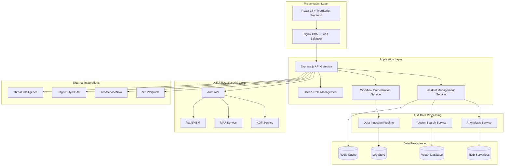

# VectorVault - Advanced Security Operations Platform

> **Next-Generation SOC Platform** - AI-powered threat detection, proactive incident management, and zero-trust authentication with the revolutionary A.S.T.R.A. framework

## Table of Contents
- [Overview](#overview)
- [Key Features](#key-features)
- [Architecture](#architecture)
- [Quick Start](#quick-start)
- [Production Deployment](#production-deployment)
- [Database Configuration](#database-configuration)
- [Authentication & Security](#authentication--security)
- [API Documentation](#api-documentation)
- [Development Guide](#development-guide)
- [Performance Optimization](#performance-optimization)
- [Monitoring & Observability](#monitoring--observability)
- [Troubleshooting](#troubleshooting)
- [Contributing](#contributing)

## Overview

VectorVault is an enterprise-grade Security Operations Center (SOC) platform that revolutionizes cybersecurity through AI-driven threat detection and the innovative A.S.T.R.A. (Advanced Security & Token-Based Rotating Authentication) framework. Built for modern zero-trust environments, it provides real-time incident management, predictive threat analysis, and unparalleled security through ephemeral credentials and role-embedded cryptography.

### Why VectorVault?

Traditional reactive security systems are inadequate against modern threats. VectorVault shifts the paradigm from reactive to **proactive and predictive** security operations:

- **Proactive Threat Detection**: AI-powered LLM predicts system failures and security breaches before they occur
- **Zero-Trust Native**: Built-in A.S.T.R.A. framework implements true zero-trust authentication
- **AI-Accelerated Response**: Automated root cause analysis reduces MTTD (Mean Time to Detect) and MTTR (Mean Time to Respond)
- **Enterprise-Ready**: Kubernetes-native with horizontal scaling and enterprise integrations

## Key Features

### 🤖 AI-Powered Intelligence
- **Predictive Analysis**: LLM-based system failure and vulnerability prediction
- **Semantic Search**: Vector-based similarity search across historical incidents
- **Automated Triage**: AI-driven alert correlation and prioritization
- **Root Cause Analysis**: Instant analysis with confidence scoring

### 🔐 Advanced Security (A.S.T.R.A.)
- **Ephemeral Credentials**: Daily rotating hashes with "New day, new hash" paradigm
- **MFA-Integrated Cryptography**: Multi-factor authentication bound into hash derivation
- **Role-Embedded Security**: Cryptographic role separation preventing privilege escalation
- **Zero-Trust Architecture**: Continuous verification and least-privilege access

### 📊 Operational Excellence
- **Real-time Dashboards**: Live security posture visualization
- **Incident Lifecycle Management**: Complete CRUD operations with workflow automation
- **Performance Analytics**: MTTD, MTTR, and resolution rate tracking
- **Enterprise Integrations**: SIEM, ITSM, SOAR, and threat intelligence platforms

### 🏗️ Enterprise Architecture
- **Microservices Design**: Scalable, resilient, independently deployable services
- **Kubernetes Native**: Container orchestration with auto-scaling
- **Multi-Database Strategy**: Polyglot persistence optimized for different data types
- **Service Mesh Ready**: Istio integration for advanced traffic management

## Architecture



## Quick Start

### Prerequisites

- **Node.js** 18+ and npm
- **Docker** and Docker Compose
- **TiDB Serverless** account
- **Kubernetes** cluster (for production)

### Local Development

```bash
# Clone the repository
git clone https://github.com/your-org/vectorvault.git
cd vectorvault

# Install dependencies
npm install

# Configure environment
cp .env.example .env
# Edit .env with your credentials

# Start development environment
npm run dev:full

# Access the application
# Frontend: http://localhost:8080
# API: http://localhost:3001
```

### Docker Development

```bash
# Start with Docker Compose
docker-compose up -d

# Scale services
docker-compose up -d --scale app=3

# View logs
docker-compose logs -f app
```

## Production Deployment

### Kubernetes Deployment

VectorVault is designed for enterprise Kubernetes environments with comprehensive production features.

#### 1. Prerequisites

```bash
# Required tools
kubectl version --client
helm version
istioctl version

# Recommended cluster specifications
# - Minimum 3 worker nodes
# - 8 CPU cores, 32GB RAM per node
# - SSD storage with 1000 IOPS
# - Load balancer support
```

#### 2. Namespace and Configuration

```bash
# Create namespace
kubectl create namespace vectorvault

# Create configuration secrets
kubectl create secret generic vectorvault-config \
  --from-literal=TIDB_HOST='your-tidb-host' \
  --from-literal=TIDB_PASSWORD='your-password' \
  --from-literal=REDIS_PASSWORD='your-redis-password' \
  --namespace=vectorvault

# Create TLS certificates
kubectl create secret tls vectorvault-tls \
  --cert=path/to/tls.crt \
  --key=path/to/tls.key \
  --namespace=vectorvault
```

#### 3. Deploy Core Services

```yaml
# vectorvault-deployment.yaml
apiVersion: apps/v1
kind: Deployment
metadata:
  name: vectorvault-app
  namespace: vectorvault
spec:
  replicas: 3
  selector:
    matchLabels:
      app: vectorvault
  template:
    metadata:
      labels:
        app: vectorvault
    spec:
      containers:
      - name: app
        image: vectorvault/app:latest
        ports:
        - containerPort: 3000
        env:
        - name: NODE_ENV
          value: "production"
        - name: TIDB_HOST
          valueFrom:
            secretKeyRef:
              name: vectorvault-config
              key: TIDB_HOST
        resources:
          requests:
            memory: "1Gi"
            cpu: "500m"
          limits:
            memory: "2Gi"
            cpu: "1000m"
        livenessProbe:
          httpGet:
            path: /api/health
            port: 3000
          initialDelaySeconds: 30
          periodSeconds: 10
        readinessProbe:
          httpGet:
            path: /api/ready
            port: 3000
          initialDelaySeconds: 5
          periodSeconds: 5
---
apiVersion: v1
kind: Service
metadata:
  name: vectorvault-service
  namespace: vectorvault
spec:
  selector:
    app: vectorvault
  ports:
  - protocol: TCP
    port: 80
    targetPort: 3000
  type: LoadBalancer
```

#### 4. Auto-scaling Configuration

```yaml
# hpa.yaml
apiVersion: autoscaling/v2
kind: HorizontalPodAutoscaler
metadata:
  name: vectorvault-hpa
  namespace: vectorvault
spec:
  scaleTargetRef:
    apiVersion: apps/v1
    kind: Deployment
    name: vectorvault-app
  minReplicas: 2
  maxReplicas: 10
  metrics:
  - type: Resource
    resource:
      name: cpu
      target:
        type: Utilization
        averageUtilization: 70
  - type: Resource
    resource:
      name: memory
      target:
        type: Utilization
        averageUtilization: 80
  behavior:
    scaleDown:
      stabilizationWindowSeconds: 300
      policies:
      - type: Percent
        value: 50
        periodSeconds: 60
    scaleUp:
      stabilizationWindowSeconds: 60
      policies:
      - type: Percent
        value: 100
        periodSeconds: 15
```

#### 5. Deploy with Helm

```bash
# Install VectorVault using Helm
helm repo add vectorvault https://charts.vectorvault.com
helm repo update

# Deploy to production
helm install vectorvault vectorvault/vectorvault \
  --namespace vectorvault \
  --values production-values.yaml \
  --set image.tag=v2.1.0 \
  --set replicaCount=3 \
  --set autoscaling.enabled=true

# Upgrade deployment
helm upgrade vectorvault vectorvault/vectorvault \
  --namespace vectorvault \
  --set image.tag=v2.2.0
```

### Container Configuration

#### Production Dockerfile

```dockerfile
# Multi-stage production build
FROM node:18-alpine AS builder

WORKDIR /app
COPY package*.json ./
RUN npm ci --only=production && npm cache clean --force

COPY . .
RUN npm run build

FROM node:18-alpine AS production

# Security: non-root user
RUN addgroup -g 1001 -S nodejs
RUN adduser -S vectorvault -u 1001

WORKDIR /app

# Copy built application
COPY --from=builder --chown=vectorvault:nodejs /app/dist ./dist
COPY --from=builder --chown=vectorvault:nodejs /app/node_modules ./node_modules
COPY --from=builder --chown=vectorvault:nodejs /app/package.json ./package.json

# Security configurations
RUN apk add --no-cache tini
USER vectorvault

EXPOSE 3000

# Health check
HEALTHCHECK --interval=30s --timeout=3s --start-period=5s --retries=3 \
  CMD node healthcheck.js

ENTRYPOINT ["/sbin/tini", "--"]
CMD ["node", "dist/server.js"]
```

### Cloud Provider Deployments

#### AWS EKS

```bash
# Create EKS cluster
eksctl create cluster --name vectorvault-prod \
  --version 1.28 \
  --region us-west-2 \
  --nodegroup-name vectorvault-nodes \
  --node-type m5.xlarge \
  --nodes 3 \
  --nodes-min 2 \
  --nodes-max 10 \
  --managed

# Install AWS Load Balancer Controller
helm repo add eks https://aws.github.io/eks-charts
helm install aws-load-balancer-controller eks/aws-load-balancer-controller \
  --set clusterName=vectorvault-prod \
  --set serviceAccount.create=false \
  --set serviceAccount.name=aws-load-balancer-controller \
  -n kube-system
```

#### Google GKE

```bash
# Create GKE cluster
gcloud container clusters create vectorvault-prod \
  --zone us-central1-a \
  --num-nodes 3 \
  --enable-autoscaling \
  --min-nodes 2 \
  --max-nodes 10 \
  --machine-type n1-standard-4 \
  --enable-autorepair \
  --enable-autoupgrade

# Get credentials
gcloud container clusters get-credentials vectorvault-prod --zone us-central1-a
```

#### Azure AKS

```bash
# Create resource group
az group create --name vectorvault-rg --location eastus

# Create AKS cluster
az aks create \
  --resource-group vectorvault-rg \
  --name vectorvault-prod \
  --node-count 3 \
  --enable-addons monitoring \
  --enable-autoscaler \
  --min-count 2 \
  --max-count 10 \
  --node-vm-size Standard_D4s_v3

# Get credentials
az aks get-credentials --resource-group vectorvault-rg --name vectorvault-prod
```

## Database Configuration

### TiDB Serverless Setup

VectorVault leverages TiDB Serverless for distributed SQL with vector search capabilities.

#### 1. Cluster Configuration

```sql
-- Database initialization
CREATE DATABASE IF NOT EXISTS vectorvault 
  CHARACTER SET utf8mb4 
  COLLATE utf8mb4_unicode_ci;

USE vectorvault;

-- Core incidents table
CREATE TABLE IF NOT EXISTS incidents (
  id VARCHAR(50) PRIMARY KEY,
  title VARCHAR(255) NOT NULL,
  description TEXT NOT NULL,
  category VARCHAR(100) NOT NULL,
  severity ENUM('Critical','High','Medium','Low') NOT NULL,
  status ENUM('Active','Investigating','Contained','Resolved','Scheduled') NOT NULL,
  timestamp DATETIME NOT NULL,
  resolution TEXT,
  tags JSON,
  sources JSON,
  embedding JSON,
  created_at TIMESTAMP DEFAULT CURRENT_TIMESTAMP,
  updated_at TIMESTAMP DEFAULT CURRENT_TIMESTAMP ON UPDATE CURRENT_TIMESTAMP,
  INDEX idx_severity (severity),
  INDEX idx_status (status),
  INDEX idx_category (category),
  INDEX idx_timestamp (timestamp)
);

-- Vector index for semantic search
CREATE VECTOR INDEX IF NOT EXISTS idx_incident_embedding
ON incidents(embedding)
DIMENSION 1536
METRIC_TYPE COSINE;

-- A.S.T.R.A. authentication tables
CREATE TABLE IF NOT EXISTS users (
  id VARCHAR(50) PRIMARY KEY,
  username VARCHAR(100) UNIQUE NOT NULL,
  email VARCHAR(255) UNIQUE NOT NULL,
  role VARCHAR(50) NOT NULL,
  salt_user BINARY(16) NOT NULL,
  password_hash TEXT NOT NULL,
  hash_version TINYINT DEFAULT 1,
  mfa_enabled BOOLEAN DEFAULT FALSE,
  mfa_secret VARCHAR(255),
  created_at TIMESTAMP DEFAULT CURRENT_TIMESTAMP,
  updated_at TIMESTAMP DEFAULT CURRENT_TIMESTAMP ON UPDATE CURRENT_TIMESTAMP,
  last_login TIMESTAMP,
  INDEX idx_role (role),
  INDEX idx_email (email)
);

-- Session management for A.S.T.R.A.
CREATE TABLE IF NOT EXISTS user_sessions (
  id VARCHAR(50) PRIMARY KEY,
  user_id VARCHAR(50) NOT NULL,
  refresh_token_hash VARCHAR(255) NOT NULL,
  device_fingerprint VARCHAR(255),
  ip_address VARCHAR(45),
  expires_at TIMESTAMP NOT NULL,
  created_at TIMESTAMP DEFAULT CURRENT_TIMESTAMP,
  FOREIGN KEY (user_id) REFERENCES users(id) ON DELETE CASCADE,
  INDEX idx_user_id (user_id),
  INDEX idx_expires_at (expires_at)
);
```

#### 2. Connection Configuration

```typescript
// Database connection with connection pooling
import { createPool } from 'mysql2/promise';

const pool = createPool({
  host: process.env.TIDB_HOST,
  port: parseInt(process.env.TIDB_PORT || '4000'),
  user: process.env.TIDB_USER,
  password: process.env.TIDB_PASSWORD,
  database: process.env.TIDB_DATABASE,
  ssl: {
    rejectUnauthorized: true,
  },
  connectionLimit: 20,
  acquireTimeout: 60000,
  timeout: 60000,
  reconnect: true,
});
```

### Redis Configuration

Redis is used for caching, session storage, and real-time features.

```yaml
# redis-deployment.yaml
apiVersion: apps/v1
kind: Deployment
metadata:
  name: redis
  namespace: vectorvault
spec:
  replicas: 1
  selector:
    matchLabels:
      app: redis
  template:
    metadata:
      labels:
        app: redis
    spec:
      containers:
      - name: redis
        image: redis:7-alpine
        ports:
        - containerPort: 6379
        command:
        - redis-server
        - --requirepass
        - $(REDIS_PASSWORD)
        - --appendonly
        - "yes"
        env:
        - name: REDIS_PASSWORD
          valueFrom:
            secretKeyRef:
              name: vectorvault-config
              key: REDIS_PASSWORD
        volumeMounts:
        - name: redis-storage
          mountPath: /data
        resources:
          requests:
            memory: "256Mi"
            cpu: "100m"
          limits:
            memory: "512Mi"
            cpu: "200m"
      volumes:
      - name: redis-storage
        persistentVolumeClaim:
          claimName: redis-pvc
```

## Authentication & Security

### A.S.T.R.A. Framework Implementation

The Advanced Security & Token-Based Rotating Authentication (A.S.T.R.A.) framework provides enterprise-grade security through innovative cryptographic techniques.

#### Core Components

```typescript
// A.S.T.R.A. KDF Pipeline Implementation
class ASTRAAuthentication {
  private readonly pepperSys: Buffer;
  private readonly hsm: HSMService;

  async authenticateUser(
    username: string,
    password: string,
    role: string,
    mfaCode: string
  ): Promise<AuthResult> {
    const dateFactory = this.getCurrentDateFactor();
    
    // Stage 1: HMAC Pre-hashing (Day & System Binding)
    const preHash = this.hmacSha256(
      this.pepperSys,
      Buffer.concat([
        Buffer.from(username),
        Buffer.from(role),
        Buffer.from(dateFactory),
        Buffer.from(password)
      ])
    );

    // Stage 2: PBKDF2 (CPU-Cost Slowdown)
    const userSalt = await this.getUserSalt(username);
    const roleSalt = await this.getRoleSalt(role);
    const pbkdf2Hash = await this.pbkdf2(
      preHash,
      Buffer.concat([userSalt, roleSalt]),
      200000
    );

    // Stage 3: Role Shuffle (Cryptographic Role Separation)
    const shuffledHash = this.shuffleRoleBytes(pbkdf2Hash, role);

    // Stage 4: MFA Integration (Binding the Second Factor)
    const secondFactorProof = await this.generateSFP(username, mfaCode);
    const mfaBoundHash = this.hmacSha256(secondFactorProof, shuffledHash);

    // Stage 5: Argon2id (Memory-Hard Resistance)
    const finalHash = await argon2.hash(mfaBoundHash, {
      type: argon2.argon2id,
      memoryCost: 131072, // 128MB
      timeCost: 3,
      parallelism: 2,
      salt: this.deriveSalt(dateFactory, role, userSalt)
    });

    return this.verifyHash(username, finalHash);
  }

  private getCurrentDateFactor(): string {
    return new Date().toISOString().split('T')[0]; // YYYY-MM-DD
  }

  private shuffleRoleBytes(hash: Buffer, role: string): Buffer {
    // Feistel-based deterministic byte shuffling keyed by role
    const roleKey = this.deriveRoleKey(role);
    return this.feistelShuffle(hash, roleKey, 4); // 4 rounds
  }
}
```

#### JWT Token Management

```typescript
// Zero-Trust JWT Implementation
class JWTService {
  async issueTokens(user: User): Promise<TokenPair> {
    const accessToken = jwt.sign(
      {
        sub: user.id,
        role: user.role,
        amr: ['mfa'], // Authentication Method Reference
        risk_score: await this.calculateRiskScore(user),
        iat: Math.floor(Date.now() / 1000),
        exp: Math.floor(Date.now() / 1000) + 900, // 15 minutes
      },
      this.accessTokenSecret,
      { algorithm: 'RS256' }
    );

    const refreshToken = await this.generateSecureRefreshToken();
    await this.storeRefreshToken(user.id, refreshToken);

    return { accessToken, refreshToken };
  }

  async rotateTokens(refreshToken: string): Promise<TokenPair> {
    // Invalidate used refresh token (one-time use)
    await this.invalidateRefreshToken(refreshToken);
    
    const user = await this.validateRefreshToken(refreshToken);
    return this.issueTokens(user);
  }
}
```

### Security Policies

#### Password Policy

```typescript
const passwordPolicy = {
  minLength: 12,
  requireUppercase: true,
  requireLowercase: true,
  requireNumbers: true,
  requireSymbols: true,
  preventReuse: 5, // Last 5 passwords
  checkBreachedPasswords: true,
  maxAge: 90, // Days
};
```

#### Multi-Factor Authentication

```typescript
// FIDO2/WebAuthn preferred, TOTP fallback
class MFAService {
  async enrollWebAuthn(userId: string): Promise<PublicKeyCredentialCreationOptions> {
    return {
      challenge: crypto.randomBytes(32),
      rp: { name: 'VectorVault', id: 'vectorvault.com' },
      user: {
        id: Buffer.from(userId),
        name: await this.getUserEmail(userId),
        displayName: await this.getUserDisplayName(userId),
      },
      pubKeyCredParams: [{ alg: -7, type: 'public-key' }],
      authenticatorSelection: {
        authenticatorAttachment: 'platform',
        requireResidentKey: false,
        userVerification: 'required',
      },
    };
  }
}
```

## API Documentation

### Authentication Endpoints

#### POST /api/auth/login
Authenticate user with A.S.T.R.A. framework.

```typescript
interface LoginRequest {
  username: string;
  password: string;
  mfaCode: string;
  deviceFingerprint?: string;
}

interface LoginResponse {
  accessToken: string;
  refreshToken: string;
  user: {
    id: string;
    username: string;
    role: string;
    permissions: string[];
  };
  expiresIn: number;
}
```

#### POST /api/auth/refresh
Rotate access and refresh tokens.

```bash
curl -X POST http://localhost:3001/api/auth/refresh \
  -H "Content-Type: application/json" \
  -d '{"refreshToken": "your-refresh-token"}'
```

### Incident Management Endpoints

#### GET /api/incidents
Retrieve incidents with advanced filtering.

```typescript
interface IncidentQuery {
  page?: number;
  limit?: number;
  severity?: ('Critical' | 'High' | 'Medium' | 'Low')[];
  status?: ('Active' | 'Investigating' | 'Contained' | 'Resolved')[];
  category?: string[];
  dateFrom?: string;
  dateTo?: string;
  assignee?: string;
  tags?: string[];
}
```

#### POST /api/incidents
Create new incident with automatic vectorization.

```typescript
interface CreateIncidentRequest {
  title: string;
  description: string;
  category: string;
  severity: 'Critical' | 'High' | 'Medium' | 'Low';
  priority?: number;
  tags?: string[];
  sources?: string[];
  assignee?: string;
}
```

### Vector Search Endpoints

#### POST /api/vector-search
Perform semantic similarity search.

```typescript
interface VectorSearchRequest {
  query: string;
  filters?: {
    categories?: string[];
    severity?: string[];
    status?: string[];
    dateRange?: string;
    similarityThreshold?: number;
  };
  limit?: number;
  includeEmbedding?: boolean;
}

interface VectorSearchResponse {
  results: Array<{
    incident: Incident;
    similarity: number;
    confidence: number;
  }>;
  totalResults: number;
  searchTime: number;
  queryEmbedding?: number[];
}
```

### AI Analysis Endpoints

#### POST /api/ai/analyze
Perform AI-powered incident analysis.

```typescript
interface AnalysisRequest {
  incidentId: string;
  context?: string;
  includeRecommendations?: boolean;
  includeSimilarCases?: boolean;
}

interface AnalysisResponse {
  rootCause: {
    hypothesis: string;
    confidence: number;
    evidence: string[];
  };
  riskAssessment: {
    threatLevel: string;
    businessImpact: string;
    estimatedCost: number;
  };
  recommendations: Array<{
    action: string;
    priority: 'Critical' | 'High' | 'Medium' | 'Low';
    complexity: number;
    confidence: number;
  }>;
  similarCases: Array<{
    incident: Incident;
    similarity: number;
    resolution: string;
  }>;
}
```

## Development Guide

### Environment Setup

```bash
# Clone and setup
git clone https://github.com/your-org/vectorvault.git
cd vectorvault

# Install dependencies
npm install

# Setup Git hooks
npm run prepare

# Start development
npm run dev:full
```

### Environment Variables

```bash
# .env.development
# Database
VITE_TIDB_HOST=your-dev-cluster.tidbcloud.com
VITE_TIDB_PORT=4000
VITE_TIDB_USER=your-username
VITE_TIDB_PASSWORD=your-password
VITE_TIDB_DATABASE=vectorvault_dev

# A.S.T.R.A. Security
ASTRA_PEPPER_SYS=your-system-pepper-key
ASTRA_HSM_ENDPOINT=https://your-hsm-endpoint.com
JWT_ACCESS_SECRET=your-jwt-access-secret
JWT_REFRESH_SECRET=your-jwt-refresh-secret

# AI Services
OPENAI_API_KEY=sk-your-openai-key
VECTOR_DIMENSION=1536

# Redis
REDIS_HOST=localhost
REDIS_PORT=6379
REDIS_PASSWORD=your-redis-password

# External Integrations
SLACK_WEBHOOK_URL=https://hooks.slack.com/services/...
JIRA_API_TOKEN=your-jira-token
SPLUNK_API_KEY=your-splunk-key
```

### Code Structure

```
src/
├── components/              # React UI components
│   ├── ui/                 # Shadcn/ui base components
│   ├── modals/             # Modal dialogs
│   ├── forms/              # Form components
│   └── charts/             # Data visualization
├── hooks/                  # Custom React hooks
│   ├── use-tidb.ts         # Database operations
│   ├── use-auth.ts         # Authentication
│   └── use-websocket.ts    # Real-time updates
├── lib/                    # Core libraries
│   ├── auth/               # A.S.T.R.A. implementation
│   ├── api.ts              # API client
│   ├── utils.ts            # Utility functions
│   └── constants.ts        # Application constants
├── pages/                  # Application pages
│   ├── Dashboard.tsx       # Main dashboard
│   ├── VectorSearch.tsx    # Semantic search
│   ├── Incidents.tsx       # Incident management
│   └── Settings.tsx        # Configuration
├── services/               # Business logic
│   ├── incident.service.ts # Incident operations
│   ├── vector.service.ts   # Vector operations
│   └── ai.service.ts       # AI integration
└── types/                  # TypeScript definitions
    ├── incident.types.ts   # Incident interfaces
    ├── auth.types.ts       # Authentication types
    └── api.types.ts        # API response types
```

### Development Scripts

```json
{
  "scripts": {
    "dev": "vite",
    "dev:full": "concurrently \"npm run server\" \"npm run dev\"",
    "server": "node server.cjs",
    "build": "tsc && vite build",
    "preview": "vite preview",
    "test": "vitest",
    "test:coverage": "vitest --coverage",
    "lint": "eslint src --ext ts,tsx --report-unused-disable-directives --max-warnings 0",
    "lint:fix": "eslint src --ext ts,tsx --fix",
    "type-check": "tsc --noEmit",
    "format": "prettier --write \"src/**/*.{ts,tsx,js,jsx,json,css,md}\"",
    "prepare": "husky install"
  }
}
```

### Testing Strategy

```typescript
// Integration tests for A.S.T.R.A. authentication
describe('A.S.T.R.A. Authentication', () => {
  test('should authenticate user with valid credentials and MFA', async () => {
    const result = await astraAuth.authenticateUser(
      'testuser',
      'SecurePassword123!',
      'analyst',
      '123456'
    );
    
    expect(result.success).toBe(true);
    expect(result.tokens.accessToken).toBeDefined();
    expect(result.tokens.refreshToken).toBeDefined();
  });

  test('should reject authentication with invalid MFA', async () => {
    const result = await astraAuth.authenticateUser(
      'testuser',
      'SecurePassword123!',
      'analyst',
      '000000'
    );
    
    expect(result.success).toBe(false);
    expect(result.error).toBe('Invalid MFA code');
  });

  test('should rotate credentials daily', async () => {
    const today = new Date().toISOString().split('T')[0];
    const tomorrow = new Date(Date.now() + 86400000).toISOString().split('T')[0];
    
    const todayHash = await astraAuth.deriveHash('testuser', 'password', 'analyst', today);
    const tomorrowHash = await astraAuth.deriveHash('testuser', 'password', 'analyst', tomorrow);
    
    expect(todayHash).not.toBe(tomorrowHash);
  });
});

// Vector search performance tests
describe('Vector Search Performance', () => {
  test('should return results within 500ms', async () => {
    const startTime = Date.now();
    
    const results = await vectorSearch.search(
      'DDoS attack on web infrastructure',
      { limit: 10 }
    );
    
    const responseTime = Date.now() - startTime;
    expect(responseTime).toBeLessThan(500);
    expect(results).toHaveLength(10);
  });
});
```

## Performance Optimization

### Database Optimization

#### Connection Pooling

```typescript
// Optimized connection pool configuration
const poolConfig = {
  connectionLimit: 20,
  acquireTimeout: 60000,
  timeout: 60000,
  reconnect: true,
  // Connection pool optimization
  idleTimeout: 300000,
  leakDetectionTimeout: 60000,
  // Query optimization
  multipleStatements: false,
  queryTimeout: 30000,
};
```

#### Query Optimization

```sql
-- Optimized incident search with proper indexing
EXPLAIN SELECT 
  id, title, severity, status, timestamp, 
  VEC_COSINE_DISTANCE(embedding, ?) as similarity
FROM incidents 
WHERE 
  category IN (?) 
  AND severity IN (?) 
  AND timestamp >= ?
  AND VEC_COSINE_DISTANCE(embedding, ?) < ?
ORDER BY similarity ASC 
LIMIT ?;

-- Performance indexes
CREATE INDEX idx_category_severity_timestamp ON incidents(category, severity, timestamp);
CREATE INDEX idx_status_timestamp ON incidents(status, timestamp);
```

#### Caching Strategy

```typescript
class CacheService {
  private redis: Redis;
  
  async cacheVectorResults(query: string, results: any[], ttl: number = 300) {
    const key = `vector_search:${this.hashQuery(query)}`;
    await this.redis.setex(key, ttl, JSON.stringify(results));
  }
  
  async getCachedResults(query: string): Promise<any[] | null> {
    const key = `vector_search:${this.hashQuery(query)}`;
    const cached = await this.redis.get(key);
    return cached ? JSON.parse(cached) : null;
  }
  
  // Intelligent cache invalidation
  async invalidateIncidentCache(incidentId: string) {
    const keys = await this.redis.keys('vector_search:*');
    const pipeline = this.redis.pipeline();
    keys.forEach(key => pipeline.del(key));
    await pipeline.exec();
  }
}
```

### Frontend Optimization

#### Code Splitting and Lazy Loading

```typescript
// Route-based code splitting
const Dashboard = lazy(() => import('./pages/Dashboard'));
const VectorSearch = lazy(() => import('./pages/VectorSearch'));
const Incidents = lazy(() => import('./pages/Incidents'));
const Settings = lazy(() => import('./pages/Settings'));

// Component lazy loading with Suspense
<Suspense fallback={<LoadingSpinner />}>
  <Routes>
    <Route path="/" element={<Dashboard />} />
    <Route path="/search" element={<VectorSearch />} />
    <Route path="/incidents" element={<Incidents />} />
    <Route path="/settings" element={<Settings />} />
  </Routes>
</Suspense>
```

#### Virtual Scrolling for Large Datasets

```typescript
import { FixedSizeList as List } from 'react-window';

const VirtualIncidentList: React.FC<{ incidents: Incident[] }> = ({ incidents }) => (
  <List
    height={600}
    itemCount={incidents.length}
    itemSize={120}
    width="100%"
  >
    {({ index, style }) => (
      <div style={style}>
        <IncidentCard incident={incidents[index]} />
      </div>
    )}
  </List>
);
```

### API Performance

#### Request Optimization

```typescript
// API response compression
app.use(compression({
  filter: (req, res) => {
    if (req.headers['x-no-compression']) return false;
    return compression.filter(req, res);
  },
  threshold: 1024
}));

// Response caching headers
app.use((req, res, next) => {
  if (req.method === 'GET') {
    res.set('Cache-Control', 'public, max-age=300'); // 5 minutes
  }
  next();
});
```

## Monitoring & Observability

### Prometheus Metrics

```typescript
// Custom application metrics
const prometheus = require('prom-client');

const httpRequestDuration = new prometheus.Histogram({
  name: 'http_request_duration_seconds',
  help: 'Duration of HTTP requests in seconds',
  labelNames: ['method', 'route', 'status_code'],
  buckets: [0.1, 0.3, 0.5, 0.7, 1, 3, 5, 7, 10]
});

const vectorSearchDuration = new prometheus.Histogram({
  name: 'vector_search_duration_seconds',
  help: 'Duration of vector search operations',
  labelNames: ['query_type'],
  buckets: [0.05, 0.1, 0.25, 0.5, 1, 2.5, 5, 10]
});

const authenticationAttempts = new prometheus.Counter({
  name: 'authentication_attempts_total',
  help: 'Total authentication attempts',
  labelNames: ['method', 'result']
});
```

### Grafana Dashboard Configuration

```json
{
  "dashboard": {
    "title": "VectorVault Production Dashboard",
    "panels": [
      {
        "title": "Request Rate",
        "targets": [
          {
            "expr": "rate(http_requests_total[5m])",
            "legendFormat": "{{method}} {{route}}"
          }
        ]
      },
      {
        "title": "Response Time Percentiles",
        "targets": [
          {
            "expr": "histogram_quantile(0.95, rate(http_request_duration_seconds_bucket[5m]))",
            "legendFormat": "95th percentile"
          },
          {
            "expr": "histogram_quantile(0.50, rate(http_request_duration_seconds_bucket[5m]))",
            "legendFormat": "50th percentile"
          }
        ]
      },
      {
        "title": "Error Rate",
        "targets": [
          {
            "expr": "rate(http_requests_total{status_code=~\"5..\"}[5m]) / rate(http_requests_total[5m])",
            "legendFormat": "Error Rate"
          }
        ]
      }
    ]
  }
}
```

### Application Logging

```typescript
import winston from 'winston';

const logger = winston.createLogger({
  level: 'info',
  format: winston.format.combine(
    winston.format.timestamp(),
    winston.format.errors({ stack: true }),
    winston.format.json()
  ),
  defaultMeta: { service: 'vectorvault-api' },
  transports: [
    new winston.transports.File({ filename: 'error.log', level: 'error' }),
    new winston.transports.File({ filename: 'combined.log' })
  ]
});

// Structured logging for security events
logger.info('User authentication attempt', {
  userId: user.id,
  method: 'A.S.T.R.A.',
  success: true,
  ipAddress: req.ip,
  userAgent: req.get('User-Agent'),
  timestamp: new Date().toISOString()
});
```

### Health Checks

```typescript
// Comprehensive health check endpoint
app.get('/api/health', async (req, res) => {
  const health = {
    status: 'ok',
    timestamp: new Date().toISOString(),
    uptime: process.uptime(),
    services: {
      database: await checkDatabaseHealth(),
      redis: await checkRedisHealth(),
      ai_service: await checkAIServiceHealth(),
      vector_search: await checkVectorSearchHealth()
    },
    metrics: {
      memory: process.memoryUsage(),
      cpu: process.cpuUsage()
    }
  };
  
  const allHealthy = Object.values(health.services).every(service => service.status === 'healthy');
  
  res.status(allHealthy ? 200 : 503).json(health);
});
```

## Troubleshooting

### Common Issues

#### 1. Authentication Failures

```bash
# Check A.S.T.R.A. service status
kubectl logs -f deployment/vectorvault-app | grep "A.S.T.R.A"

# Verify HSM connectivity
curl -X GET http://localhost:3001/api/health/hsm

# Common fixes:
# - Verify system pepper in HSM
# - Check MFA service connectivity
# - Validate user salt generation
# - Confirm date factor alignment
```

#### 2. Vector Search Performance

```bash
# Check vector index status
SELECT * FROM INFORMATION_SCHEMA.VECTOR_INDEXES 
WHERE TABLE_NAME = 'incidents';

# Monitor search performance
kubectl top pods -l app=vectorvault

# Performance tuning:
# - Increase vector index cache
# - Optimize embedding dimensions
# - Implement result caching
```

#### 3. Database Connection Issues

```bash
# Test TiDB connectivity
mysql -h your-tidb-host -P 4000 -u username -p

# Check connection pool status
curl -X GET http://localhost:3001/api/health/database

# Connection fixes:
# - Verify SSL certificates
# - Check connection limits
# - Review network policies
```

#### 4. Memory Issues

```yaml
# Increase memory limits
resources:
  requests:
    memory: "2Gi"
    cpu: "1000m"
  limits:
    memory: "4Gi"
    cpu: "2000m"

# Enable garbage collection optimization
env:
- name: NODE_OPTIONS
  value: "--max-old-space-size=3072"
```

### Debug Commands

```bash
# Application logs
kubectl logs -f deployment/vectorvault-app --tail=100

# Database queries
kubectl exec -it deployment/vectorvault-app -- npm run db:debug

# Performance profiling
kubectl exec -it deployment/vectorvault-app -- npm run profile

# Memory analysis
kubectl exec -it deployment/vectorvault-app -- npm run heap-dump
```

### Error Codes

| Code | Description | Resolution |
|------|-------------|------------|
| AUTH001 | Invalid A.S.T.R.A. credentials | Verify password and MFA code |
| AUTH002 | Expired session token | Refresh tokens or re-authenticate |
| AUTH003 | Role permission denied | Check user role assignments |
| VECTOR001 | Vector search timeout | Optimize query or increase timeout |
| VECTOR002 | Invalid embedding dimensions | Verify embedding model compatibility |
| DB001 | Connection pool exhausted | Increase connection limits |
| DB002 | Query timeout | Optimize query or increase timeout |

## Contributing

### Development Workflow

```bash
# 1. Fork and clone
git clone https://github.com/your-username/vectorvault.git
cd vectorvault

# 2. Create feature branch
git checkout -b feat/new-feature

# 3. Install dependencies
npm install

# 4. Make changes and test
npm run test
npm run lint
npm run type-check

# 5. Commit with conventional commits
git commit -m "feat: add advanced vector search filters"

# 6. Push and create PR
git push origin feat/new-feature
```

### Code Standards

```typescript
// ESLint configuration
module.exports = {
  extends: [
    '@typescript-eslint/recommended',
    'plugin:react/recommended',
    'plugin:react-hooks/recommended'
  ],
  rules: {
    '@typescript-eslint/explicit-function-return-type': 'error',
    '@typescript-eslint/no-explicit-any': 'error',
    'react/prop-types': 'off',
    'react/react-in-jsx-scope': 'off'
  }
};
```

### Testing Requirements

- Unit tests: >90% coverage
- Integration tests for all API endpoints
- E2E tests for critical user flows
- Security tests for A.S.T.R.A. authentication
- Performance tests for vector search

### Documentation Standards

- JSDoc for all functions
- README updates for new features
- API documentation with examples
- Deployment guide updates
- Security review for sensitive changes


<div align="center">
  
**Built with ❤️**

*VectorVault - Transforming reactive security into proactive defense*

</div>
